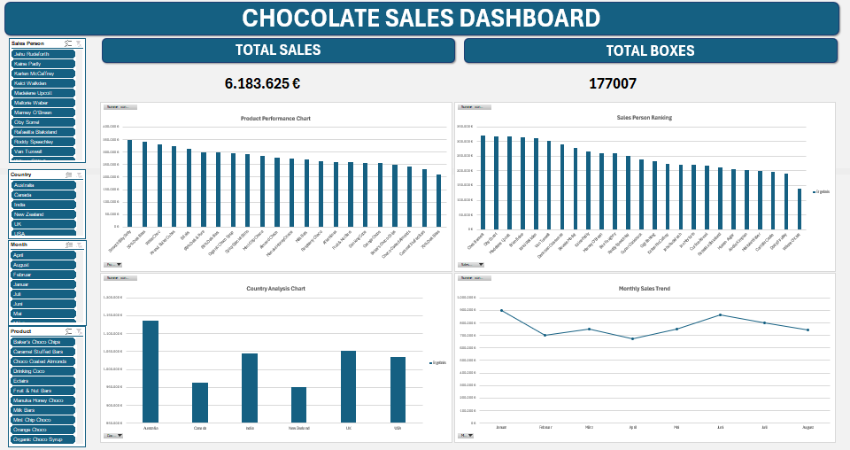

# Excel_Dashboard
# 📊 Sales Performance Dashboard (Excel)

An interactive sales dashboard built in Microsoft Excel using PivotTables, Data Model, and Slicers.

---

## 🎯 Business Objective

The goal of this project is to analyze sales performance across:

- Total Revenue
- Shipment Volume (Boxes)
- Monthly Sales Trends
- Product Performance
- Country-Level Sales Distribution
- Sales Person Ranking

---

## 📂 Dataset

The dataset contains sales transactions for the year 2022 including:

- Sales Person
- Country
- Product
- Date
- Revenue (Amount)
- Boxes Shipped

Total Revenue: €6.18M  
Average Revenue per Box: €34.93  

---

## 🛠 Tools & Techniques Used

- Microsoft Excel
- Power Query
- Data Model (Power Pivot)
- DAX Measure (Avg Sales per Box)
- PivotTables & PivotCharts
- Slicers
- GETPIVOTDATA function

---

## 📈 Key Insights

- Januar shows the highest monthly sales.
- Australia is the strongest performing market.
- Product sales are relatively balanced.
- Revenue reached €6.18M in 2022.

---

## 🖼 Dashboard Preview

---

## 🚀 What I Learned

- Building interactive dashboards in Excel

- Using Data Model to connect multiple PivotTables
- Writing DAX measures in Excel
- Translating raw data into business insights
